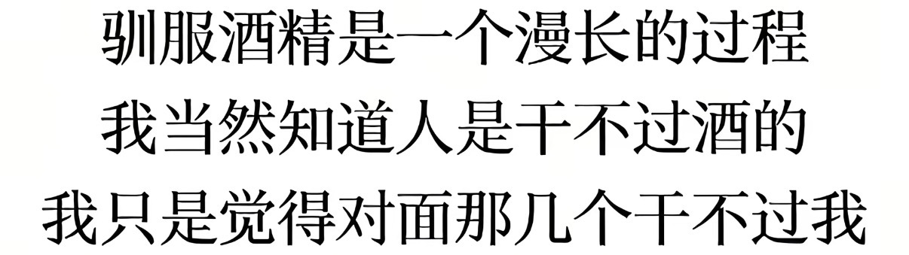

# 👋 Hi, I'm Austin | 你好，我是李欣雨

*An Unconventional **Finance & Management & Law** AI Enthusiast*
*非典型**经管法**AI发烧友*

---

## 🙋 About Me | 关于我

I have a complex education background ranging from law to CS. During my undergraduate studies, I majored in the **Dual Major of Law and Finance**, minored in **Computer Science** and earned a **Honored Bachelor of Mathematics**. And I chose to pursue a master’s degree in **public policy**. My primary research method is quantitative empirical analysis, though I also incorporate some optimization techniques from software engineering based on my personal interests.

本人教育经历极其之复杂（）本科期间我主修专业是**法学和金融学双学位**，辅修**计算机**并且获得了学校的**数学荣誉学士**，但在保研期间我选择了**公共政策**超级水水水专业（课少、学硕、两年、方便实习）。正经一点来说的话，由于我的复合背景，在做研究时我的方法主要是定量实证，偏向于经济学研究范式，兴趣集中在实证法学、公共政策分析和环境经济学；同时，由于本人有轻微程度的技术主义倾向，在进行实证分析时一般会引入一些在计算机领域用烂了但是在经管法领域很新奇的新方法，主要是工程上的优化。

I’ve also done internships in finance (both of primary and secondary markets), law and consulting, and ultimately decided to go on early-stage opportunities in the primary market (VC/FA). My interests lie in the **technology** and **consumption** sectors, and I’m currently focusing on the AI space with a particular preference for institutions that primarily invest in the first three rounds. If you’ve read this far and think I sound like an interesting person, feel free to reach out.

笨人也在一直实习实践，在**金融机构、MBB和律所**都有实习，并且确认自己未来的方向主要还是集中在一级早期，买卖均可。方向上偏好于**科技**和**消费**，当前主要看AI赛道，其中AI2C的赛道看的更多（窄就窄吧无所谓我自己喜欢），轮次更偏好与**A轮及之前**。如果你看到这里觉得我是个还算有意思的人，欢迎来领英connect或随时email我。

- 🔭 Currently working on: VC internship of AI industry | 目前在做：AI赛道的VC小登
- 🌱 Currently learning: Vibe Coding | 正在学习：Claude/GPT肝代码
- 💬 Ask me about: Startup finance or anything related to AI | 可以和我聊：初创融资/任何和AI有关的事儿
- 📫 Reach me at: LinkedIn or email | 联系方式：最上方领英/邮件

---

## 🎓 Education Background | 教育背景

### 2026 – 2028 | Shanghai University of Finance and Economics | 上海财经大学

- *Master of Management, Major in Public Policy | 管理学硕士，公共政策专业*

### 2022 – 2026 | Southwestern University of Finance and Economics | 西南财经大学

- *Bachelor of Dual Degree in Economics and Law, Major in Finance and Law | 经济学与法学双学士，法学与金融学专业*
- *Honored Bachelor of Science, Minored in Mathematics | 数学荣誉学士，数学与应用数学专业*
- *Minor in Computer Science | 辅修计算机科学与技术专业*
- **GPA | 绩点:** 4.1/5.0
- **Honors | 荣誉奖项：** National Scholarship国家奖学金, Honored Graduate优秀毕业生

---

## 💼 Internship and Program | 实习与项目经历

> *This is one of the sections I care most about — a record of where I've been and what I've built.*
> *这是我最看重的部分，记录我走过的地方和做过的事。*

### 🏢 [Company Name] | [公司名称]
**[Position Title] | [职位名称]** · 📍 [City] · 📅 [Month Year] – [Month Year]

**EN:**
- [Achievement 1: what you did + measurable outcome, e.g., "Conducted market mapping of 40+ AI startups across 6 verticals, producing an internal investment landscape report"]
- [Achievement 2]
- [Achievement 3]

**中文：**
- [成果 1：做了什么 + 可量化的结果，例如：完成 6 个赛道 40 余家 AI 初创公司的市场地图梳理，产出内部投资图谱报告]
- [成果 2]
- [成果 3]

### 🏢 [Company Name 2] | [公司名称 2]
**[Position Title] | [职位名称]** · 📍 [City] · 📅 [Month Year] – [Month Year]

**EN:**
- [Achievement 1]
- [Achievement 2]

**中文：**
- [成果 1]
- [成果 2]

### 🌏 [Program Name, e.g., Exchange / Fellowship / Competition] | [项目名称]
**[Role] | [角色]** · 📅 [Month Year] – [Month Year]

**EN:** [One or two sentences describing the program and your contribution.]

**中文：** [一到两句话描述该项目及你的贡献。]

---

## 🛠️ Personal Vibe Coding Projects | 个人 Vibe Coding 项目

> *Projects built with the help of AI tools — proof that ideas matter more than syntax.*
> *借助 AI 工具完成的项目，证明想法比语法更重要。*

### 📌 [Project Name 1] | [项目名称 1]
**Tools | 工具：** `Claude` `Cursor` `[Other tools]`
🔗 [Repo](https://github.com/yourusername/project1) · [Live Demo](https://your-demo-link.com)

**EN:** [What it does, why you built it, what you learned. 2-3 sentences.]

**中文：** [项目功能、动机、收获。两到三句话。]

### 📌 [Project Name 2] | [项目名称 2]
**Tools | 工具：** `[Tools used]`
🔗 [Repo](https://github.com/yourusername/project2)

**EN:** [Description.]

**中文：** [描述。]

---

### 📊 GitHub Stats | GitHub 数据

*Thanks for visiting! | 感谢访问！*

